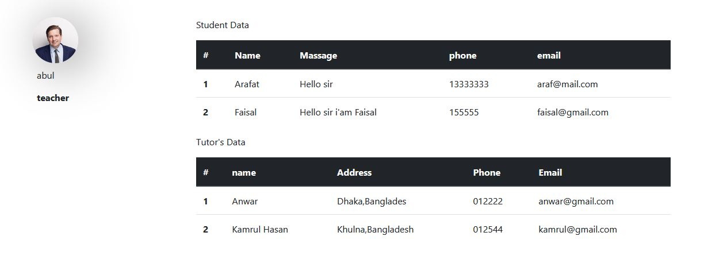

# PHP_UDEMY_CLONE_practice_one

# Technologies

  1.HTML  
  2.CSS  
  3.JS  
  4.PHP  
  5.MySQL  
 
# Features
1.Login  
2.Registration  
3.Admin Profile & DashBoard  
4.Catagory Show from Database  
5.All Product show (Dynamically)  
6.Single Product Description(Dynamically)  
7.About Us Page (Dynamically)  
8.Contact Us Page  
9.Embaded youtube and Google map   

## Login page 
 

## Registration page 
 

## Adminpanel page 
 

## Catagories page 
 

## All Products page 
 

## Single Products page 
 

## Contact us page 
 

## Google Map embade
 

## Youtube embade 
 

## Database embade 
